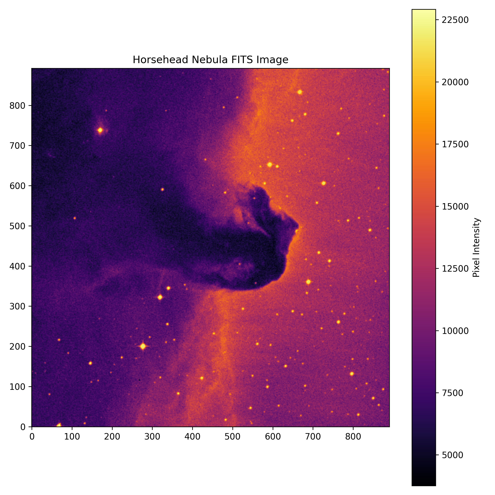

# Fits-file-viewer
Beginner astronomy project for loading, visualizing and exploring FITS astronomical files using Python and Astropy.
## Features

- Load FITS files
- Display FITS headers
- Plot astronomical images
- Save image previews

## Dataset

Horsehead Nebula FITS image

## Tools

- Python
- Astropy
- NumPy
- Matplotlib
## Output Preview

# FITS File Viewer

